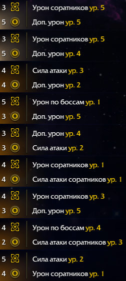

# Калькулятор Arkgrid с эффектами
## Функциональные кнопки
- ```На главную``` - переход на главую страницу (ВНИМАНИЕ: НЕСОХРАНЕННЫЕ ДАННЫЕ ПРОПАДУТ СРАЗУ, ПОКА НЕ ПОФИКСИЛ)
- ```С эффектов``` - переход на режим с эффектами рунитов (ВНИМАНИЕ: НЕСОХРАНЕННЫЕ ДАННЫЕ ПРОПАДУТ СРАЗУ, ПОКА НЕ ПОФИКСИЛ)
- ```Сохранить``` - сохранение текущих данных. Необходимо ввести уникальное название сохранения. Повторяющееся имя будет перезаписано
- ```Загрузить``` - Можно выбрать локальные сохранения для загрузки, выгрузить их в json файл или импортировать чужие данные


### Ввод рунитов ручной

- ```Тип рунита``` - влиент на то, в какие ядра он может установится
- ```Заряд```- Заряд рунита
- ```Очки```- Очки Хаоса/Порядка рунита

### Ввод рунитов с помощью распознавания
#### Сканировать из скриншота
- ```Сканировать из скриншота``` - пока поддерживаются только изображения. Можно выбрать среди файлов, перетащить или же вставить из буфера обмен.
- После завершения все распознанные руниты добавятся автоматически

Очень важно правильно делать правильные скриншоты. Для максимальной точности распознавания необходимо, чтоб скриншот попадали только значения зарядов и очков и эффекты.

### Пример скриншота


### Список рунитов
- ```Руниты``` - список всех добавленных рунитов. Назначенные руниты на ядра выделяются особыми стилями с иконами ядра
- ```Отчистить все``` - удаляет все руниты

### Ввод ядер

- ```Тип ядра``` - пока ни на что не влияет, но можно выбрать только по одному разу каждого типа
- ```Ранг``` - влияет на возможные целевые очки и вместимость по зарядам
- ```Цель очков```- Цель, к которой надо прийти в процессе калькуляции

### КНОПКА РАСЧЕТА АРКГРИД В САМОМ НИЗУ СТРАНИЦЫ
